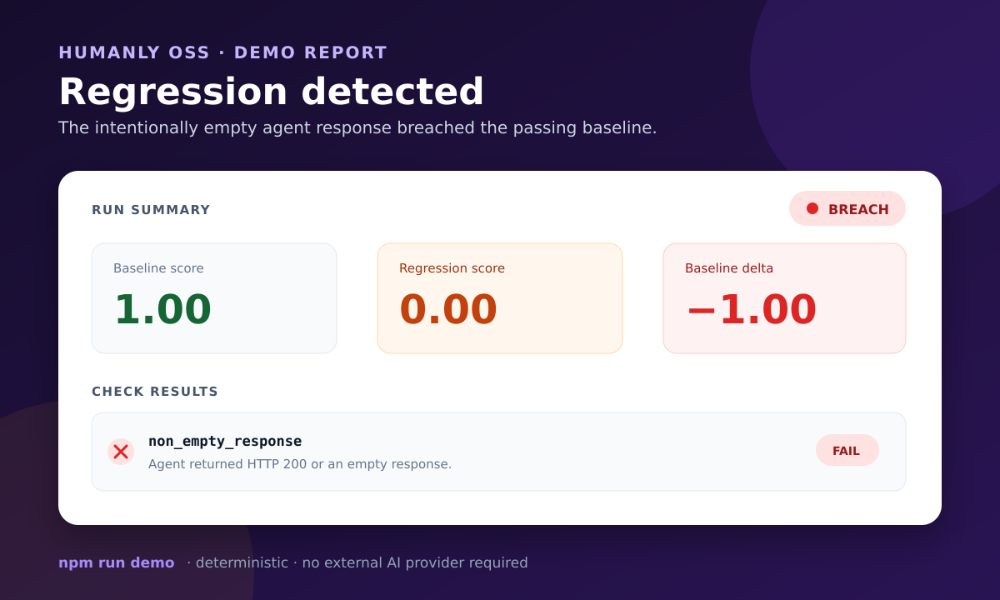
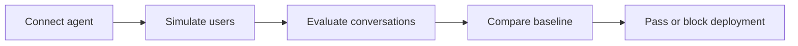

# Humanly

### Regression testing for AI agents through synthetic users

Humanly simulates realistic users, runs multi-turn conversations against
your AI agent, evaluates the outcomes and detects regressions before deployment.

[Try Humanly Studio](https://humanly.ai) · [Quick Start](#quick-start) · [Documentation](docs/quickstart.mdx)

[](https://github.com/somnath-biswas-github/humanly/actions/workflows/ci.yml)
[](https://github.com/somnath-biswas-github/humanly/actions/workflows/self-hosted-smoke.yml)
[](LICENSE)
[](package.json)



_An actual report produced by `npm run demo`: the baseline passed, the
intentionally empty agent response failed, and the regression gate detected the
drop._

## How it works



Humanly OSS v0.1 implements the connector, deterministic evaluation, report,
baseline, and quality-gate path. Humanly Studio adds the hosted visual workflow
and richer synthetic-user evaluation.

## Two ways to use Humanly

| Humanly OSS | Humanly Studio |
| --- | --- |
| For developers and engineering teams | For product, design, QA, and engineering teams |
| Self-hosted with Docker and PostgreSQL | Hosted at [humanly.ai](https://humanly.ai) |
| REST API plus TypeScript SDK and CLI source | Visual, no-code test creation and analysis |
| Legacy one-turn suites plus scripted multi-turn L1–L5 workflows | LLM-generated multi-turn synthetic users and the broader evaluation catalog |
| AGPL-3.0-or-later | Proprietary hosted product |

## Why Humanly

- **Synthetic-user testing:** Humanly Studio exercises LLM-generated multi-turn
  behaviour instead of relying only on isolated prompts. That kind of synthetic
  conversation remains on the OSS roadmap. The legacy OSS suite path performs
  one-turn connector evaluations; the separate workflow runner supports
  test-authored scripted multi-turn L1–L5 checks today.
- **Behaviour and outcome evaluation:** OSS starts with a deterministic
  non-empty-response check. Studio provides the broader set of available
  evaluation checks.
- **Regression baselines:** save the score from a known run and detect later
  quality drops.
- **CI/CD deployment gates:** retrieve a machine-readable report and fail a
  pipeline when `baselineBreach` is `true`.

## Quick start

### Prerequisites

- Docker Engine
- Docker Compose v2
- A free local port (5000 by default)

No OpenAI key, Studio account, or session secret is required for this OSS
release.

```bash
git clone https://github.com/somnath-biswas-github/humanly.git
cd humanly
cp .env.example .env

# Put a long random value in HUMANLY_API_KEY.
# This command generates one on systems with OpenSSL:
openssl rand -hex 32

docker compose up --build
```

The first start builds the image, starts PostgreSQL, applies the versioned
migration, and then starts the API. Wait for `Humanly OSS listening`, then:

```bash
curl http://localhost:5000/health
```

Expected:

```json
{
  "status": "ok",
  "ready": true,
  "version": "0.1.0"
}
```

The exact first-start time depends on network and Docker cache state. The
self-hosted CI workflow allows up to two minutes for readiness.

## Run the included evaluation

The demo starts the same Docker stack plus a deterministic local HTTP agent. It
creates a passing run, establishes that run as a baseline, then runs an
intentional empty-response regression.

Set `HUMANLY_API_KEY` in `.env`, then run:

```bash
npm run demo
```

Successful output includes:

```text
Baseline score: 1
Regression score: 0
Baseline breached: true
Failed check: non_empty_response
Report: demo-output/report.json
```

This is a deliberate failed quality check; the demo command itself succeeds only
when Humanly detects it correctly. See the
[example report](examples/example-evaluation-report.json).

## Connect your agent

Your agent exposes an HTTP endpoint. Humanly sends:

```json
{
  "message": "Say hello to the customer.",
  "conversationId": "run_xxx_conversation_1",
  "history": []
}
```

Return JSON with `reply`, `response`, `message`, `content`, `text`, `answer`,
or `output`, or return non-empty plain text. The first string field in that
order wins; a blank string fails even if a later field contains text:

```json
{
  "response": "Hello! How can I help?"
}
```

The default suite check only verifies HTTP success and non-empty response text.
A pass does **not** establish factual correctness, groundedness, retrieval recall,
or answer completeness. RAG semantic evaluation is not included in OSS.

Create the connector through `POST /v1/connectors`:

```bash
curl -X POST http://localhost:5000/v1/connectors \
  -H "Authorization: Bearer $HUMANLY_API_KEY" \
  -H "Content-Type: application/json" \
  -d '{
    "name": "My agent",
    "agentId": "agent_xxx",
    "endpointUrl": "https://agent.example.com/chat"
  }'
```

See the [AgentConnector guide](docs/guides/agent-connector-setup.mdx) for
authentication and private-network safeguards.

## Example evaluation result

Reports contain the score, individual checks, the request and response, and
baseline comparison:

```json
{
  "status": "completed",
  "overallScore": 0,
  "passRate": 0,
  "baselineBreach": true,
  "baselineDelta": -1,
  "conversations": [{
    "passed": false,
    "checkScores": [{
      "checkName": "non_empty_response",
      "score": 0,
      "passed": false
    }]
  }]
}
```

## TypeScript SDK

`@humanlyai/sdk` is the canonical package name. The currently published npm
version (`0.1.0`) targets the hosted API and is not the SDK exercised by this
self-hosted release. Until the OSS-compatible prerelease is published, build and
install the checked-in source:

```bash
(cd packages/sdk && npm ci && npm run build && npm pack --pack-destination ../..)
npm install ./humanlyai-sdk-0.1.1-oss.0.tgz
```

```ts
import { HumanlyClient } from "@humanlyai/sdk";

const humanly = new HumanlyClient({
  apiKey: process.env.HUMANLY_API_KEY!,
  baseUrl: "http://localhost:5000",
});

const run = await humanly.triggerRun({ suiteId: "suite_xxx" });
const report = await humanly.waitForRun(run.id);

if (report.baselineBreach) process.exit(1);
```

The CLI in [`packages/cli`](packages/cli) is also source-only in v0.1 and is
**not** advertised as an installable npm package.

## CI/CD integration

Build the repository CLI, then use it as a deployment gate:

```bash
npm --prefix packages/cli ci
npm --prefix packages/cli run build

HUMANLY_BASE_URL=http://localhost:5000 \
HUMANLY_API_KEY="$HUMANLY_API_KEY" \
node packages/cli/dist/index.cjs run \
  --suite "$SUITE_ID" \
  --baseline "$BASELINE_ID" \
  --out humanly-results
```

The command exits non-zero when the report contains a baseline breach. See the
[CI/CD guide](docs/guides/ci-cd.mdx).

## Capabilities

Available in OSS v0.1:

- API-key authenticated `/v1` REST API
- Agents, connectors, suites, runs, reports, personas, and baselines
- HTTP AgentConnector with bearer and API-key forwarding
- Private, loopback, link-local, and reserved destination blocking by default
- One-turn deterministic non-empty-response evaluation (existing default)
- Scripted multi-turn workflow evaluation: L1 policy/action, L2 approval,
  L3 state/target, L4 structured tool-outcome consistency and L5 progress/termination.
  See [workflow evaluation](docs/workflow-evaluation.md) for Studio/OSS parity,
  runtime evidence, runnable faulty/fixed fixtures and quality gates.
- PostgreSQL persistence and automatic versioned migrations
- Docker readiness health check
- OSS-compatible TypeScript SDK, CLI, and Python SDK source

Not included in OSS v0.1:

- The Humanly Studio web interface
- LLM-generated multi-turn synthetic users
- Studio’s evaluation-check catalog
- RAG semantic evaluation, Studio's general LLM trace-scoring catalog, webhooks,
  teams, or billing. Structured workflow event evaluation is supported separately.

## Documentation

- [Quick start](docs/quickstart.mdx)
- [Self-hosting](docs/self-hosting.mdx)
- [AgentConnector guide](docs/guides/agent-connector-setup.mdx)
- [First test run](docs/guides/first-test-run.mdx)
- [Regression baselines](docs/guides/regression-baselines.mdx)
- [REST API](sdk/api/overview.mdx)
- [TypeScript SDK](sdk/typescript/overview.mdx)
- [Roadmap and issue candidates](docs/ROADMAP.md)

Run `npm run check:links` to validate repository-internal documentation links.

## Contributing

See [CONTRIBUTING.md](CONTRIBUTING.md), the
[Code of Conduct](CODE_OF_CONDUCT.md), and the prepared
[good first issue candidates](docs/ROADMAP.md#good-first-issue-candidates).
Security issues must follow [SECURITY.md](SECURITY.md), not a public issue.

## Project status

**Current maturity: beta / initial `0.1.0` release candidate.**

Stable enough for the first release:

- Clean Docker build and PostgreSQL startup
- Automatic migration and readiness health check
- Versioned API and deterministic starter evaluation
- Baseline comparison and JSON reports

Beta:

- TypeScript, Python, and CLI client surfaces
- Operational hardening beyond a single-node deployment

Planned:

- More deterministic checks
- Multi-turn OSS execution
- JUnit export
- OpenAPI documentation
- Scoped API-key management

See [CHANGELOG.md](CHANGELOG.md) and the
[issue-ready roadmap](docs/ROADMAP.md).

## Licence

Humanly OSS is licensed under [AGPL-3.0-or-later](LICENSE). Humanly Studio is
proprietary and is not included in this repository.

If this release is useful, consider
[starring the repository](https://github.com/somnath-biswas-github/humanly).